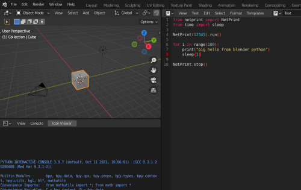

# netprint

NetPrint is a little helper class for quick and dirty debugging Python scripts. Occasionally you may find it as usefull as I to simpy print some information in your
source code out to the terminal. For instance developing an addon for blender only windows user are offered a "console", when blender encounters a problem or display
information. Linux and Mac Users don't have it. Or working on an embedded device like Raspi it may come in handy to watch the output of standard print statements on your 
smartphone, tablet or laptop. In the simplest case a telnet connection will be enough. 

NetPrint is a direct descendant of socket from the standard python library, so all options from socket.socket are available.

## Installation
Simply download netprint.py into your project directory or use a pip install

**pip install git+https://github.com/dh1ao/netprint**

## Usage
In your script import netprint
#### from netprint import NetPrint

and at the begin of your script execute
#### NetPrint().run()
and that's it. Now every print or error in your script will be send to port 65432, which is the default port.
If you like another port, it's the first positional parameter in the constructor
#### NetPrint(12345).run()
Now stdout and stderr is redirected to port 12345. You may use NetPrint(port=12345) as well

Another parameter is throttle, which defines the duration between successive read's of stdout and stderr. Default is 100 ms aka 0.1
The rest of the parameters is as documented in https://docs.python.org/3/library/socket.html

#### Example
```python
from netprint import NetPrint
from time import sleep

NetPrint(12345).run()

for i in range(100000):  
    print("TEST ", i)  
    sleep(1)

NetPrint.stop()
```



